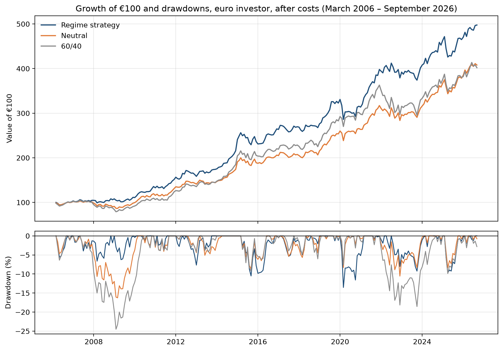

# Macro Regime Allocation Model

Can macro regimes, combinations of rising or falling growth and inflation, be identified soon enough to improve a portfolio? This project classifies the US and the Euro area into four regimes each month and tests a regime-based allocation for a euro investor, with realistic publication lags and trading costs.

📄 **Report:** [report/macro_regime_report.pdf](report/macro_regime_report.pdf)

Data downloaded on 8 October 2026; backtest period March 2006 – September 2026.

## Key findings

| | Regime strategy | Neutral | 60/40 |
|---|---|---|---|
| Annual return | 8.11% | 7.07% | 6.99% |
| Volatility | 8.55% | 8.02% | 9.74% |
| Return / volatility | 0.95 | 0.88 | 0.72 |
| Maximum drawdown | −13.5% | −16.3% | −24.5% |

*Euro investor, monthly rebalancing, after 0.1% trading costs. Return / volatility is a simplified Sharpe ratio without a risk-free rate.*

- **The regimes carry some information, but the edge is small and not statistically significant.** Regime tilts added about 1 percentage point a year over a static neutral portfolio, but a block bootstrap gives a 95% interval of [−0.9, +3.0] points and a permutation test gives p ≈ 0.10.
- **The edge is period-dependent.** It comes mostly from 2008 and disappears after 2016; for a US investor its timing reverses. The model helps in gradual downturns and fails after sudden shocks such as 2020.
- **Timeliness of the growth signal matters.** At the same lag, industrial production and the Economic Sentiment Indicator perform similarly, but industrial production is published too late and its information fades quickly; the sentiment survey is available sooner and stays useful after a delay.
- **Portfolio construction is the robust result.** The static seven-asset portfolio had lower volatility and a much smaller worst loss than 60/40 in every test. Most of the smaller loss comes from its lower equity share and shorter bond duration; gold and commodities improved its return relative to risk, mainly after 2016.



## Method

1. **Regimes.** Growth and inflation are each classified as rising or falling relative to their trailing 12-month average, giving four regimes: Goldilocks, Overheating, Slowdown and Stagflation. US: industrial production and CPI. Euro area: the European Commission's Economic Sentiment Indicator (ESI) and HICP inflation.
2. **Asset behaviour.** Returns of seven ETFs (US and European equities, long and short US Treasuries, investment-grade credit, gold, commodities) in each regime, in USD and EUR.
3. **Backtest.** A euro investor tilts a neutral portfolio by the Euro area regime, applied with a one-month publication lag (two months for the US version). Tilts are fixed in advance from economic reasoning, not fitted to the data. Benchmarks: the neutral portfolio and 60/40.
4. **Robustness.** Two halves of the sample, lags of 0–4 months, two growth measures, trading costs, a US investor version, a block bootstrap, a permutation test, results without 2008, an equity-matched benchmark and the stock–bond correlation by regime.
5. **Current positioning.** The model applied to the latest data: in October 2026 both regions are in Overheating.

## Structure

```
data/
  macro_data.csv        Growth and inflation, industrial production version (1997–)
  signal_inputs.csv     Series behind the final regimes (US IP and CPI, EA ESI and HICP)
  regimes.csv           Monthly regimes, US and Euro area
  returns_usd.csv       Monthly ETF returns in USD
  returns_eur.csv       Monthly ETF returns in EUR
  regime_weights.csv    Portfolio weights by regime
notebooks/
  01_data_pipeline.ipynb    Macro data download and regime classification
  02_asset_returns.ipynb    Asset returns by regime, USD vs EUR
  03_backtest.ipynb         Backtest, publication lags, trading costs and robustness tests
  04_current_regime.ipynb   Current regime and implied portfolio
figures/                    Charts used in the report
report/                     Written report (PDF and Word)
```

## Data sources

- **FRED:** US CPI (`CPIAUCSL`), US industrial production (`INDPRO`), EUR/USD (`DEXUSEU`)
- **ECB Data Portal:** Euro area HICP inflation; Euro area industrial production (first version of the model)
- **Eurostat:** Economic Sentiment Indicator, euro area (`ei_bssi_m_r2`, `EA21`)
- **Yahoo Finance** via `yfinance`: ETF prices adjusted for dividends and splits (SPY, VGK, TLT, SHY, LQD, GLD, DBC)

Re-running the notebooks downloads the latest data, so results can change slightly as series are revised or extended.

## How to run

```
python -m venv .venv
.venv\Scripts\activate
pip install -r requirements.txt
```

Then run the notebooks in order: 01 → 02 → 03 → 04.

## Main limitations

The sample starts in 2006 and much of the edge depends on 2008; the backtest uses today's revised data with publication lags rather than real-time vintages; monthly signals react late to sudden shocks; and two growth measures and several lags were examined, so the significance tests are somewhat optimistic. See Section 9 of the report.
